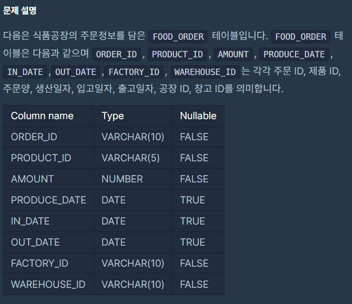
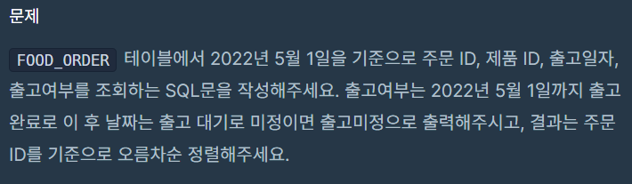

### [ 처음에 적었던 오답 ]
SELECT ORDER_ID, PRODUCT_ID, DATE_FORMAT(OUT_DATE,'%Y-%m-%d'), IF(OUT_DATE<='2022-05-01') THEN SELECT '출고완료' ELSEIF(OUTDATE>'2022-05-01') THEN SELECT '출고대기' ELSE SELECT '출고미정' AS 출고여부
FROM FOOD_ORDER
ORDER BY ORDER_ID;

### [ 오답 원인 ]

SQL 에서 조건문을 사용하는 방법에 대한 착각
MYSQL과 같은 특정 데이터베이스 제외한 대부분은 CASE 문 사용
[ 정답 ]
SELECT ORDER_ID, PRODUCT_ID, DATE_FORMAT(OUT_DATE,'%Y-%m-%d'),
       CASE
           WHEN OUT_DATE <= '2022-05-01' THEN '출고완료'
           WHEN OUT_DATE > '2022-05-01' THEN '출고대기'
           ELSE '출고미정'
       END AS 출고여부
FROM FOOD_ORDER
ORDER BY ORDER_ID;
CASE - WHEN - THEN 문
CASE
    WHEN 조건 THEN 출력값
    ELSE 출력값
END (주의📍)